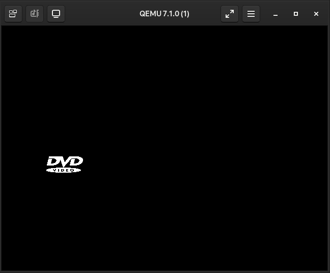
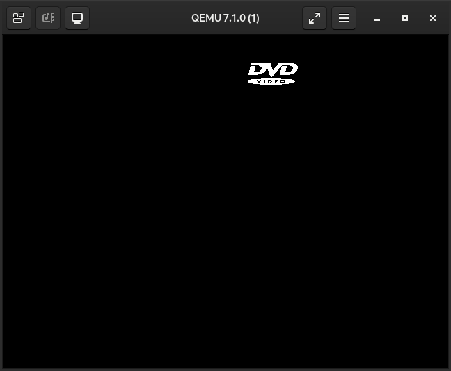

# bootsector-dvd-screensaver

Writing code for the bootsector introduces a unique problem, being limited to 512 bytes for data and code. That's right, data AND code.

Want small code? x86 assembly or C, that's fine there.

Want images? Good luck.

A 20 by 20 pixel image, with 8 bits (1 byte) per pixel, is 400 bytes. With code being about 200, that is way over the limit. There is one tradeoff we can use to save a huge amount of space, and is what makes this project possible. 

## [VGA 640x480, 2-color (video mode 11H)](http://www.techhelpmanual.com/89-video_memory_layouts.html)

Instead of having a byte for a single pixel, 256 colours, each byte now contains 8 pixels. Each single bit inside the BIOS video memory represents a black and white (on and off) state for that pixel.

The same 20 by 20 pixel image will now be 50 bytes instead of the 400 bytes it was before. The DVD logo is a single solid colour anyway, just use it's alpha/transparency to generate a black and white image.

Rendering the DVD logo image goes like this

1. Generate a bitmapped (1 bit per pixel) raw representation of the image with a python script.
2. Use the `incbin` NASM directive to insert the raw file straight into the final binary, keep a label/pointer to the data.
3. In the rendering loop, keep a representation of a rectangle. It's position, size, velocity, stuff like that.
4. When drawing, copy each byte mapped from the rectangles texture coordinates straight to the VRAM.

## Want to run it?

This is what you will need.

- nasm (netwide assembler)
- objcopy and ld (binutils)
- qemu (qemu-system-i386)
- gdb (for make-debug)

What does each rule in the makefile do?

- `make` - create boot.bin to execute and boot.elf for debug symbols
- `make run` - use boot.bin and qemu to execute in a VM
- `make run-debug` - use gdb to connect to qemu's remote debugger

Some kind of POSIX enviroment is recommended. Use WSL on Windows.

## `make run`

Not like you remembered but close enough.

https://user-images.githubusercontent.com/66291634/193046875-9077a510-4074-4270-a09a-a67470257cbb.mp4

